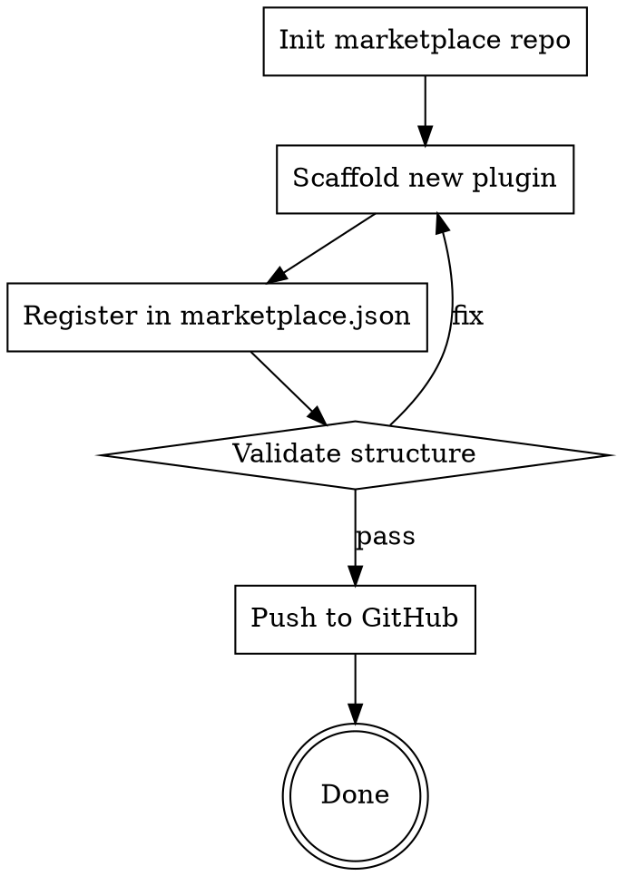

# Marketplace Creator

Create and manage Claude Code plugin marketplaces — from initializing the repository to scaffolding plugins, registering them in the marketplace registry, and maintaining quality.

## Overview

A **marketplace** is a GitHub repository containing:
1. A `marketplace.json` registry listing all available plugins
2. Optionally, first-party plugin source code in `plugins/`
3. External plugin references (pointing to other GitHub repos)

This skill handles the full lifecycle: create the repo, scaffold plugins, register them, validate quality.

## When to Use

- Creating a new marketplace repository from scratch
- Scaffolding a new Claude Code plugin (with skills, commands, hooks, agents)
- Adding a plugin to an existing marketplace registry
- Auditing/validating marketplace or plugin structure
- Managing plugin versions and metadata

## Core Workflow



## 1. Initialize Marketplace Repository

Create a new GitHub repo as a plugin marketplace:

```bash
# Use the init-marketplace-repo.sh script
bash ~/.claude/skills/marketplace-creator/scripts/init-marketplace-repo.sh <repo-name> <github-user>
```

The script creates:
- `.claude-plugin/marketplace.json` — the registry (see `references/marketplace-schema.md`)
- `plugins/` — directory for first-party plugins
- `external_plugins/` — manifests for third-party plugins
- `README.md` — marketplace documentation
- Initializes git and pushes to GitHub via `gh`

## 2. Scaffold a New Plugin

Generate the full structure for a new Claude Code plugin:

```bash
# Use the scaffold-plugin.sh script
bash ~/.claude/skills/marketplace-creator/scripts/scaffold-plugin.sh <plugin-name> [--with-skills] [--with-commands] [--with-hooks] [--with-agents] [--with-mcp]
```

This generates a complete plugin directory. See `references/plugin-anatomy.md` for the full structural reference.

**Minimum viable plugin:**
```
plugin-name/
├── .claude-plugin/
│   └── plugin.json       # name is the only required field
└── skills/
    └── main-skill/
        └── SKILL.md
```

**Full plugin (all components):**
```
plugin-name/
├── .claude-plugin/
│   └── plugin.json
├── skills/
│   └── skill-name/
│       ├── SKILL.md
│       ├── references/
│       ├── scripts/
│       └── assets/
├── commands/
│   └── command-name.md
├── agents/
│   └── agent-name.md
├── hooks/
│   └── hooks.json
├── .mcp.json              # MCP server config (optional)
├── README.md
└── LICENSE
```

### plugin.json Requirements

```json
{
  "name": "kebab-case-name",
  "description": "50-200 chars for marketplace display",
  "version": "0.1.0",
  "author": { "name": "Author Name", "email": "email@example.com" },
  "repository": "https://github.com/user/repo",
  "license": "MIT",
  "keywords": ["tag1", "tag2"]
}
```

Name must match: `^[a-z][a-z0-9]*(-[a-z0-9]+)*$`

### SKILL.md Frontmatter

Only two fields: `name` and `description` (max 1024 chars total).

**Description rules:**
- Describe WHEN to use, not what it does
- Start with "Use when..." for triggering conditions
- Include specific trigger phrases users would say
- Keep under 500 characters
- Never summarize the workflow (Claude shortcuts the description instead of reading the body)

### Hooks Format (plugin-level)

```json
{
  "hooks": {
    "EventName": [
      {
        "matcher": "pattern",
        "hooks": [
          {
            "type": "command",
            "command": "'${CLAUDE_PLUGIN_ROOT}/hooks/script.sh'",
            "async": false
          }
        ]
      }
    ]
  }
}
```

Events: PreToolUse, PostToolUse, UserPromptSubmit, Stop, SubagentStop, SessionStart, SessionEnd, PreCompact, Notification.

## 3. Register Plugin in Marketplace

Add a plugin to `marketplace.json`:

**First-party (source in marketplace repo):**
```json
{
  "name": "plugin-name",
  "description": "What this plugin does",
  "category": "development",
  "source": "./plugins/plugin-name"
}
```

**External (separate GitHub repo):**
```json
{
  "name": "plugin-name",
  "description": "What this plugin does",
  "category": "development",
  "source": {
    "source": "url",
    "url": "https://github.com/user/repo.git"
  },
  "homepage": "https://github.com/user/repo"
}
```

**Pin to specific commit:**
```json
{
  "source": {
    "source": "url",
    "url": "https://github.com/user/repo.git",
    "sha": "abc123def456"
  }
}
```

## 4. Validate Structure

Before pushing, validate:

- [ ] `marketplace.json` has valid JSON with `$schema`, `name`, `description`, `owner`, `plugins[]`
- [ ] Every plugin in `plugins[]` has `name`, `description`, `source`
- [ ] First-party plugin paths exist on disk
- [ ] Each plugin has valid `plugin.json` with at least `name`
- [ ] SKILL.md files have valid YAML frontmatter with `name` and `description`
- [ ] No orphaned directories (skills without SKILL.md)
- [ ] Description follows triggering best practices (starts with "Use when...")

## 5. Interactive Web Creator

Open the visual skill/plugin creator in a browser:

```bash
open assets/skill-creator-web.html
# Or: xdg-open, python3 -m http.server, etc.
```

The cyberpunk-themed web UI provides:
- Live plugin configuration (name, description, version, components)
- Skill editor with trigger phrase management
- Real-time structure preview (file tree, SKILL.md, plugin.json)
- Automatic validation with quality scoring (A/B/F grades)
- Copy-to-clipboard for generated output

## Progressive Disclosure

- For the complete marketplace.json schema: read `references/marketplace-schema.md`
- For detailed plugin anatomy and all component specs: read `references/plugin-anatomy.md`
- For the visual creator tool: open `assets/skill-creator-web.html`

## Common Mistakes

| Mistake | Fix |
|---------|-----|
| Description summarizes workflow | Rewrite to describe ONLY triggering conditions |
| plugin.json `name` has uppercase | Use kebab-case only |
| SKILL.md has extra frontmatter fields | Only `name` and `description` are parsed |
| hooks.json missing wrapper `{"hooks": {...}}` | Plugin hooks need the outer `hooks` key |
| Marketplace source path wrong | Use `./plugins/name` for local, URL object for external |
