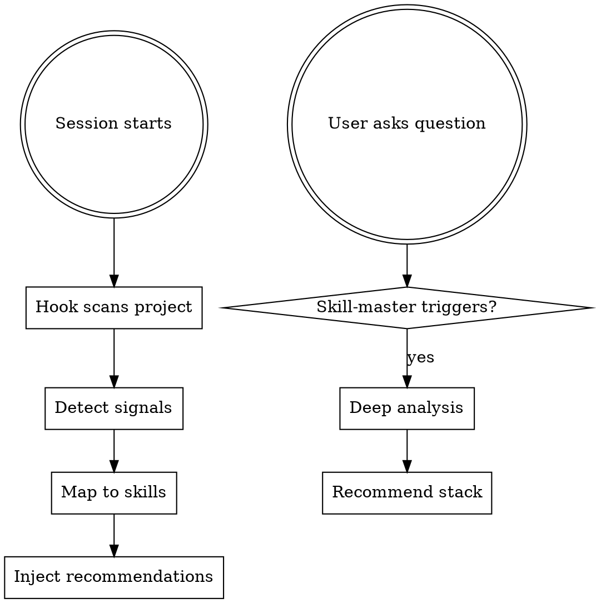
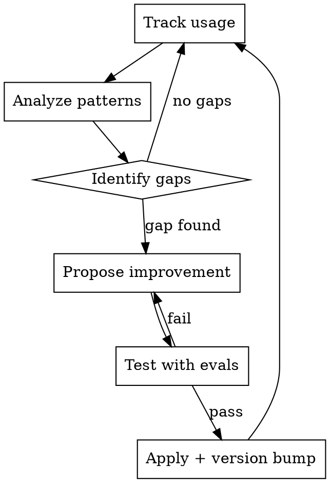

# Skill Master

Intelligent orchestrator for the entire Claude Code skill ecosystem. Provides proactive onboarding, skill recommendation, usage analytics, and adaptive growth — skills that learn and improve from how they're used.

## Architecture

Three integrated layers work together:

1. **SessionStart Hook** (proactive) — Fires on every conversation. Scans the project for signals (go.mod, Dockerfile, .claude-plugin, etc.) and injects recommended skills into context.

2. **This Skill** (knowledge) — The meta-knowledge base. Knows what every skill does, when to combine them, and how to evolve them.

3. **MCP Server** (tools) — Persistent tools for searching, recommending, installing, and evolving skills programmatically.

## Onboarding Flow



## Signal Detection

The hook detects these project signals:

| Signal | Detection | Recommended Skills |
|--------|-----------|-------------------|
| Go project | go.mod, go.sum | go-development, framegotui-sdk |
| framegotui | pkg/core/app.go, import | framegotui-sdk (critical) |
| Node.js | package.json | frontend-design |
| Docker | Dockerfile, compose | docker-deployment |
| Claude plugin | .claude-plugin/ | marketplace-creator, plugin-dev:* |
| Tailscale | tailscale.json, /var/lib/tailscale | tailscale-expert |
| Xen Orchestra | xo-cli.conf | xen-orchestra-expert |
| gRPC | proto/, buf.yaml | grpc-patterns |
| MCP | .mcp.json, pkg/mcp | plugin-dev:mcp-integration |
| Web UI | pkg/web, web/ | frontend-design |
| CLAUDE.md | CLAUDE.md exists | claude-md-management |

## Skill Combination Patterns

Some tasks need multiple skills working together:

**New biodoia project** (Go + framegotui):
1. `framegotui-sdk` — architecture patterns
2. `superpowers:test-driven-development` — TDD discipline
3. `superpowers:brainstorming` — design first
4. `marketplace-creator` — if building a plugin

**Infrastructure task** (Tailscale + XO):
1. `tailscale-expert` — VPN mesh
2. `xen-orchestra-expert` — VM management
3. `superpowers:writing-plans` — plan before executing

**Skill development** (meta):
1. `skill-creator:skill-creator` — create and test skills
2. `plugin-dev:skill-development` — plugin skill patterns
3. `superpowers:writing-skills` — TDD for skills
4. `marketplace-creator` — register in marketplace

## Adaptive Growth System

Skills evolve based on usage data. The system tracks:

### What Gets Tracked
- Which skills are invoked per project type (via PostToolUse hook)
- Which signals map to which recommendations (via SessionStart hook)
- Session logs stored in `~/.claude/skill-master-usage.jsonl`

### Growth Cycle



### Types of Adaptation

1. **Description tuning** — If a skill should trigger but doesn't, widen the description triggers. If it triggers when it shouldn't, narrow them.

2. **Signal mapping** — If users in Go projects consistently invoke `tailscale-expert`, add `go+tailscale` as a compound signal.

3. **Skill gaps** — If users repeatedly ask about a topic with no matching skill, flag it as a candidate for a new skill.

4. **Content evolution** — If a skill's references are outdated (API changes, new features), flag for refresh.

5. **Combination discovery** — If skills A and B are always used together, suggest creating a combined workflow or meta-skill.

### Running Analysis

Use the `/skill-evolve` command or the MCP tool `analyze_usage`:

```bash
# Via command
/skill-evolve

# Via MCP tool (if MCP server running)
# Tool: skill_master.analyze_usage
```

## MCP Server Tools

The MCP server exposes these tools when running:

| Tool | Description |
|------|-------------|
| `search_skills` | Search all available skills by keyword or domain |
| `recommend_stack` | Given a project path, recommend a skill stack |
| `analyze_usage` | Analyze usage.jsonl and propose improvements |
| `skill_health` | Check skill quality scores across the marketplace |
| `propose_evolution` | Generate a specific improvement proposal for a skill |

Start the server: see `mcp-server/README.md` or the `.mcp.json` config.

## Progressive Disclosure

- Full skill catalog with descriptions and categories: read `references/skill-catalog.md`
- Adaptive growth system deep dive: read `references/adaptive-growth.md`
- Usage analysis script: run `scripts/analyze-usage.py`
